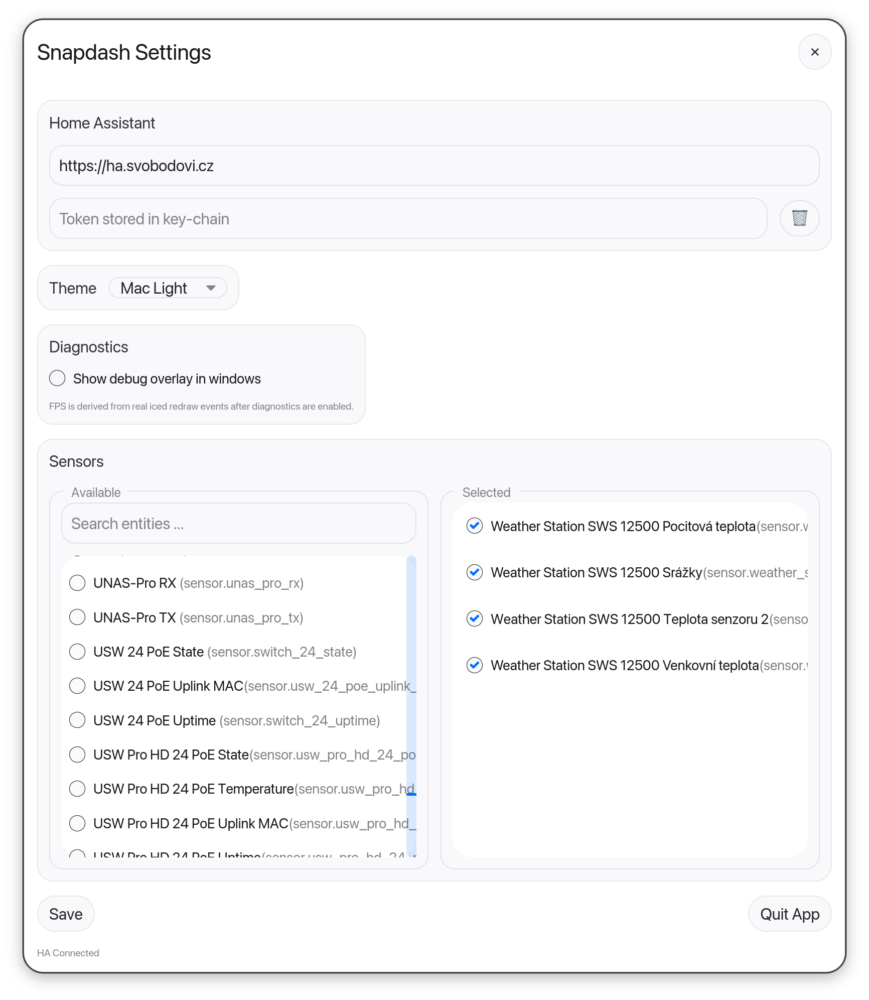
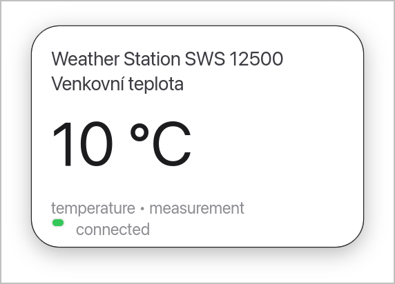

<div align="center">

# SnapDash

**A pluggable desktop widget system - Home Assistant today, anything tomorrow.**

[](https://github.com/schizza/snapdash/actions/workflows/ci.yml)
  [](https://www.apache.org/licenses/LICENSE-2.0)
  [](https://www.rust-lang.org/)
  []()

[Website](https://snapdash.schizza.cz) · [Releases](https://github.com/schizza/snapdash/releases) · [Issues](https://github.com/schizza/snapdash/issues) · [Roadmap](https://github.com/schizza/snapdash/projects)
</div>

---

Snapdash gives you a clean, always-visible snapshot of live data
— sensors, metrics, anything that streams.
Built in **Rust** for stability, performance, and 24/7 reliability, it sits quietly
on your desktop without leaks, lag, or surprises.

  Today it speaks **Home Assistant**. Tomorrow, anything you can wire up via plugins.

Built with **Rust** for stability, performance, and long-running reliability —
SnapDash is designed to run quietly in the background without leaks, lag, or surprises.

🚧 **Status: Early development / MVP** — first public release, expect rough edges.

| Widget | Settings |
|:---:|:---:|
|  |  \  |

## Features

- **Real-time** updates via Home Assistant WebSocket API
- **Frameless widgets** - pin individual sensors as floating macOS-style cards
- **Native look** - Mac Light / Mac Dark themes, smooth pulse animations on state change
- **Secure token storage** - credentials lives in OS keychain (macOD Keychain / Windows Credential Manager / Linux Secret Service), never in plain text
- **Cross-platform** - macOS, Windows, Linux
- **Lightweight** - low CPU / memory footprint, designed to run 24/7 in background
- **Pluggable (planned)** - Home Assistant is the first integration; plugin API for arbitrary data sources is on the roadmap
- **Fully customizable cards and layouts** - in progress
- **Sensor history and lightweight charts** - in progress

## Why Rust?

Because SnapDash is meant to be boring in the best possible way.

Rust lets us build a widget that doesn’t slowly eat memory, doesn’t spike the CPU, and doesn’t need babysitting. You start it, pin it to your desktop, and it just keeps doing its job.

## Installation

### Pre-built binaries

Grab the latest release for your platform from the [Releases page](https://github.com/schizza/snapdash/releases):

- **macOS**: `.tar.gz` (Apple Silicon) / `.dmg` will be added later
- **Windows**: `.zip` portable / `.msi` installer (will be added later)
- **Linux**: `.tar.gz` portable / `.AppImage`

⚠️ macOS binaries are **not yet code-signed**. Signing of application is in process now.
macOS will warn about an "unidentified developer" — open it via `Right-click → Open` once.

**"Snapdash is damaged and can't be opened" on macOS**

macOS blocks unsigned apps from the internet. Snapdash is not yet
signed with an Apple Developer ID - we are tracking this in
[#12](https://github.com/schizza/snapdash/issues/12).

**Remove the quarantine attributes** (one-time, recommended):

```bash
xattr -cr /Applications/Snapdash.app  # or where your Snapdash.app lives
```

Or right-click the app -> **Open** -> click **Open** in the dialog.
Either way, very the download first:

```bash
shasum -a 256 -c snapdash-vX.Y.Z-macos-aarch64.tar.gz.sha256
```

**Easier: install via Homebrew** (recommended):

```bash
brew tap schizza/tap
brew install --cask snapdash
```

Homebrew automatically removes the quarantione attributes and handles
updates via `brew upgrade`.

### Build from source

Requires **Rust 1.85** (2024 edition)

```bash
git clone https://github/schizza/snapdash.git
cd snapdash
cargo build --release

# Run directly
cargo run --release
```

## Quick start

1. Launch Snapdash - the **Settings** window opens automatically on first run.
2. Enter your Home Assistant URL (e. g. `http://localhost:8123`).
3. Paste your **Long-Lived Access Token** (see below).
4. Hit **Save** - Snapdash connects and lists your sensors.
5. Tick any sensor -> a floating widget appears for it.
6. Drag widget anywhere on screen. They remember their position.

## Getting a Home Assistant Long-Lived Token

1. Open your Home Assistant UI in a browser.
2. Click your **user profile** (avatar in bottom-left)
3. Go to **Security -> Long-Lived Access Tokens**
4. Click **Create token**, name it (e.g. `Snapdash`), confirm
5. Copy the token immediately - Home Assistant only shows it once.
6. Paste it into Snapdash Settings , confirm
7. Copy the token immediately - Home Assistant only shows it once.
8. Paste it into Snapdash Settings -> **Home Assistant token** field.

After saving, the token is moved to your OS keychain. The `config.json` file never contains the token.

If the token is compromised: delete it in HA, generate a new one, paste it into Snapdash Settings (the `🗑` button next to the token field also clears the keychain entry).

### Configuration

Snapdash uses a simple JSON config in your user profile.
If the config is corrupted, Snapdash falls back to defaults and writes a fresh file on next save.

### File locations

| OS | Config | Log |
| --- | --- | --- |
| **macOS** | `~/Library/Application Support/dev.snapdash.Snapdash/config.json` | `~/Library/Application Support/dev.snapdash.Snapdash/debug.log` |
| **Windows** | `%APPDATA%\dev.snapdash.Snapdash\config.json` | `%APPDATA%\dev.snapdash.Snapdash\debug.log` |
| **Linux** | `~/.config/snapdash/config.json` | `~/.local/share/snapdash/debug.log` |

## Troubleshooting

**Settings window doesn't open**
First run with no config auto-opens Settings. If it stays closed, check the log file.

**`Invalid JSON ... using defalut config` in log**
The config file got corrupted. Delete it or fix the JSON manually, then reconfigure via Settings.

**No widget windows appear despite saved entities**
Check the log for HA WebSocket errors - token expired, URL unreachable, network blocked.
Open Settings, hit **Save** again to force a reconnect.

**Token issues**
On macOS/Windows the token only lives in the keychain. To reset: in Settings, click `🗑` to clear, then paste a fresh token and save.

## Roadmap

- [X] Frameless widget windows + macOS-style theming
- [X] Home Assistant WebSocket integration with reconnect
- [X] Secure token storage in OS keychain
- [X] Real-time state updates with pulse animations
- [X] Multi-widget configuration via Settings
- [X] Local history & 24h sparkline charts
- [ ] System tray menu & autostart
- [ ] Plugin API for non-HA data sources
- [ ] Linux-specific window hacks (XShape rounded corners)
- [ ] Code-signed releases (macOS notarization, Windows signing)
- [ ] Auto-update mechanism

See the [issue tracker](https://github.com/schizza/snapdash/issues) and [project board](https://github.com/schizza/snapdash/projects) for current work.

## Tech Stack

- **[Rust](https://www.rust-lang.org/)** (2024 edition) - core language
- **[Iced](https://github.com/iced-rs/iced)** (forked) - GPU-accelerated GUI via wgpu
- **[Tokio](https://github.com/tokio-rs/tokio)** - async runtime
- **[tokio-tungstenite](https://github.com/snapview/tokio-tungstenite)** - WebSocket client
- **[reqwest](https://github.com/seanmonstar/reqwest)** - HTTP client (initial state fetch)
- **[keyring](https://github.com/hwchen/keyring-rs)** - cross-platform OS credential storage

## Contributing

Contributions welcome! Pleas read [CONTRIBUTING.md](CONTRIBUTING.MD) (TODO) and check open [issues](https://github.com/schizza/snapdash/issues) for places to start.

Bug reports and feature requests via the [issue tracker](https://github.com/schizza/snapdash/issues/new/choose).

## License

Licensed under the [Apache License, Version 2.0](LICENSE).

See [NOTICE](NOTICE) for third-party attribution.
