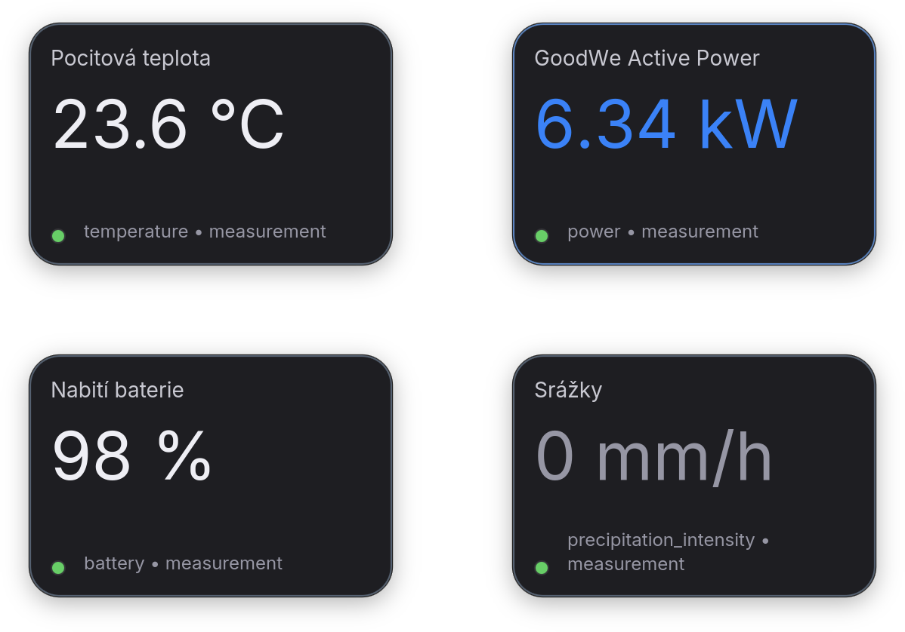
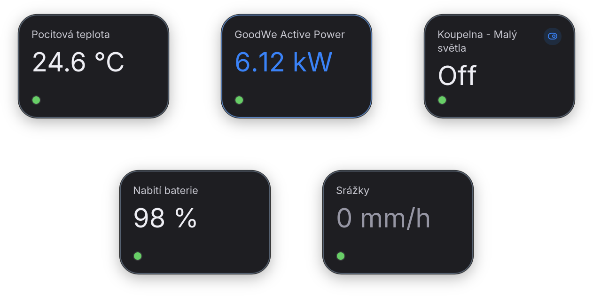
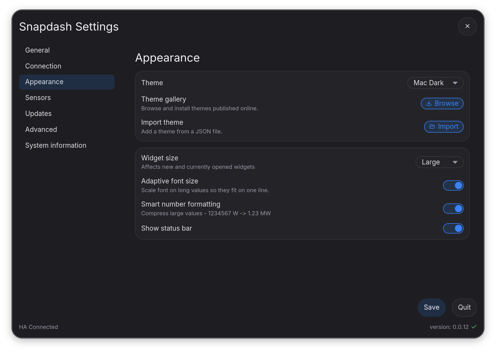
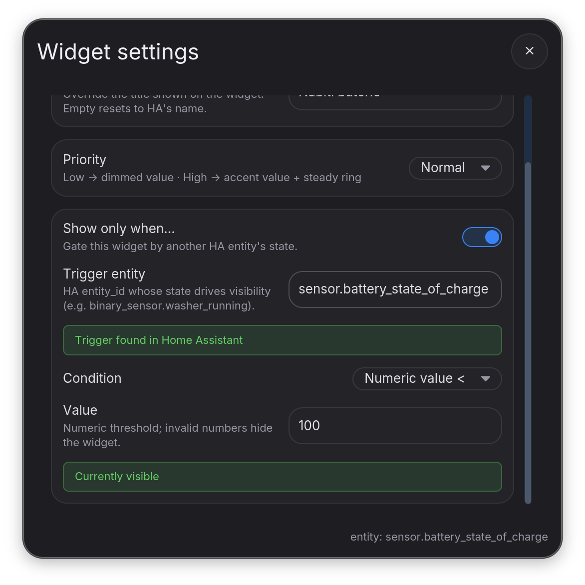
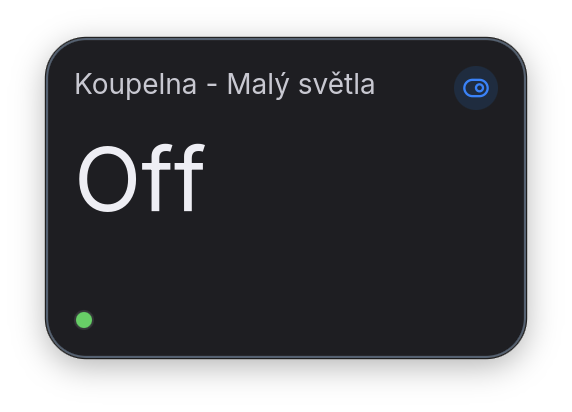
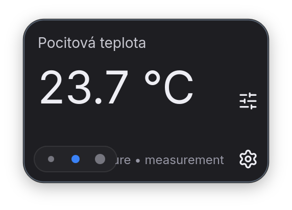
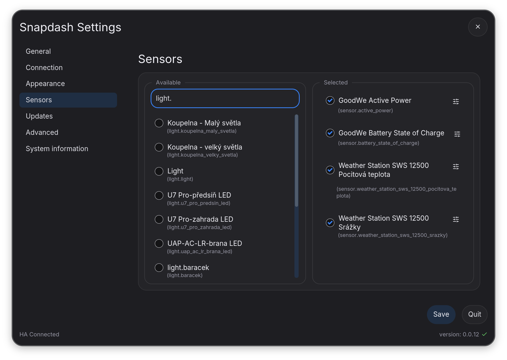
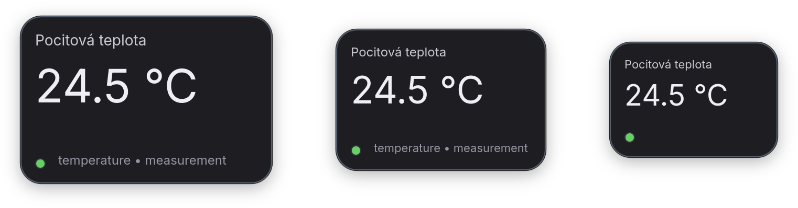
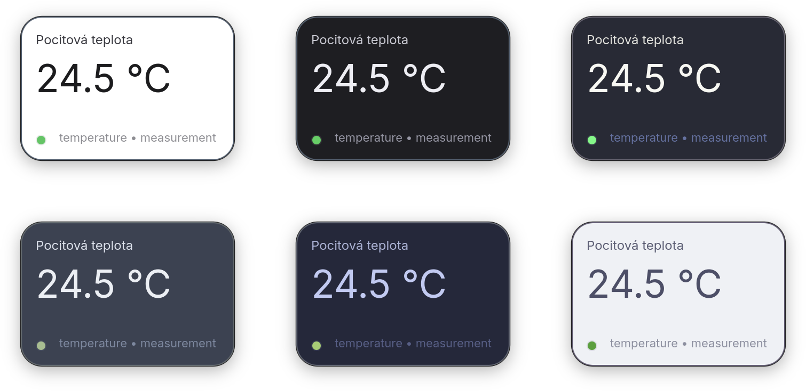
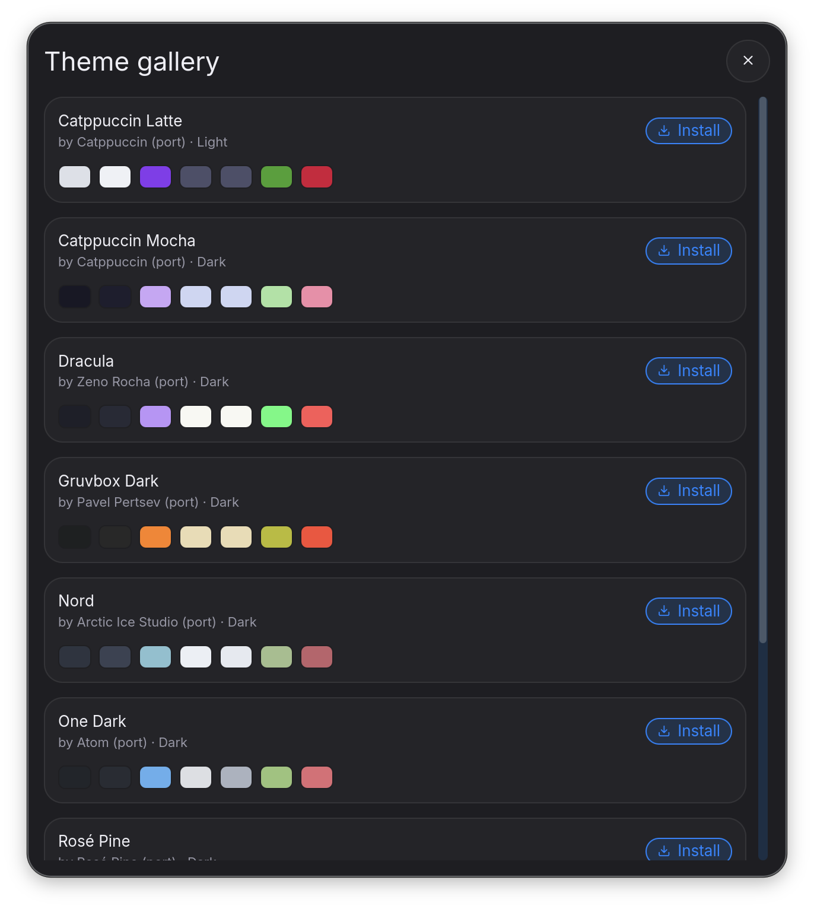

<div align="center">

# SnapDash

**A pluggable desktop widget system - Home Assistant today, anything tomorrow.**

[](https://github.com/schizza/snapdash/actions/workflows/ci.yml)
  [](https://www.apache.org/licenses/LICENSE-2.0)
  [](https://www.rust-lang.org/)
  []()

[Website](https://snapdash.rs) · [Releases](https://github.com/schizza/snapdash/releases) · [Issues](https://github.com/schizza/snapdash/issues) · [Roadmap](https://github.com/schizza/snapdash/projects)
</div>

---

Snapdash gives you a clean, always-visible snapshot of live data
— sensors, metrics, anything that streams — and lets you act on it with a
single tap.

Built with **Rust** for stability, performance, and long-running reliability,
it sits quietly on your desktop without leaks, lag, or surprises.

Today it speaks **Home Assistant**. Tomorrow, anything you can wire up via plugins.

🚧 **Status: Early development / MVP** — expect rough edges.

🎨 **Wanted: an icon designer.** Snapdash ships a placeholder icon and none of
us is a designer — [details below](#help-wanted-an-app-icon).

| Widgets on the desktop | The same desk, in the Small preset |
|:---:|:---:|
|  |  |
| *Priorities: Normal, High (accent value + steady ring), Normal, Low (dimmed)* | *Five Small cards — the light on the right is actionable* |

| Settings | Per-widget settings |
|:---:|:---:|
|  |  |
| *Appearance page* | *Custom name, priority and conditional visibility with a live verdict* |

## Features

- **Real-time** updates via the Home Assistant WebSocket API, with automatic reconnect
- **Actionable widgets** - tap a widget to toggle a switch, light or input boolean,
  run a script, or activate a scene — without opening Home Assistant
- **Frameless widgets** - pin individual entities as floating macOS-style cards
- **Native look** - Mac Light / Mac Dark themes, spring-physics pulse animations on state change
- **Custom themes** - browse and install community themes from the in-app gallery, import your own JSON, or drop a file into the themes folder. 9 themes bundled (Dracula, Nord, Catppuccin Mocha & Latte, Tokyo Night, One Dark, Rosé Pine, Gruvbox Dark, Solarized Light)
- **Widget sizing** - Small / Normal / Large presets, optional adaptive font so long values stay on one line, and smart number compression (`1234567 W` → `1.23 MW`)
- **Per-widget settings** - priority (Low / Normal / High), custom name override, and conditional visibility — all from a per-widget dialog opened with one click
- **Conditional widgets** - show a widget only when another HA entity matches a condition (e.g. *washer time remaining* only while the washer is running)
- **Secure token storage** - credentials live in OS keychain (macOS Keychain / Windows Credential Manager / Linux Secret Service), never in plain text
- **In-app updates** - check, download, SHA-256 verify and install a new release from Settings, with the release notes rendered in-app
- **Start at login** - cross-platform autostart, one toggle
- **System information** - a diagnostics page you can copy as Markdown straight into a bug report
- **Cross-platform** - macOS, Windows, Linux
- **Lightweight** - low CPU / memory footprint, designed to run 24/7 in background
- **Pluggable (planned)** - Home Assistant is the first integration; a plugin API for arbitrary data sources is on the roadmap

## Why Rust?

Because SnapDash is meant to be boring in the best possible way.

Rust lets us build a widget that doesn’t slowly eat memory, doesn’t spike the CPU, and doesn’t need babysitting. You start it, pin it to your desktop, and it just keeps doing its job.

## Installation

### Homebrew (macOS, recommended)

```bash
brew tap schizza/tap
brew install --cask snapdash
```

Homebrew removes the quarantine attribute for you and handles updates via
`brew upgrade`.

### Pre-built binaries

Grab the latest release for your platform from the [Releases page](https://github.com/schizza/snapdash/releases):

| Platform | Asset |
| --- | --- |
| **macOS** (Apple Silicon) | `snapdash-vX.Y.Z-macos-aarch64.tar.gz` — contains `Snapdash.app` |
| **Linux** (x86_64) | `snapdash-vX.Y.Z-linux-x86_64.tar.gz` — portable binary |
| **Windows** (x86_64) | `snapdash-vX.Y.Z-windows-x86_64.zip` — portable `.exe` |

Every asset ships with a matching `.sha256`. Verify before running:

```bash
shasum -a 256 -c snapdash-vX.Y.Z-macos-aarch64.tar.gz.sha256
```

Intel macOS builds, `.dmg`, `.msi` and `.AppImage` packaging are not published yet.

⚠️ macOS binaries are **not yet code-signed** — tracked in
[#12](https://github.com/schizza/snapdash/issues/12).

**"Snapdash is damaged and can't be opened" on macOS**

macOS blocks unsigned apps downloaded from the internet.

Remove the quarantine attribute (one-time, recommended):

```bash
xattr -cr /Applications/Snapdash.app  # or wherever your Snapdash.app lives
```

Or right-click the app → **Open** → click **Open** in the dialog.

### Build from source

Requires **Rust 1.94+** (2024 edition).

```bash
git clone https://github.com/schizza/snapdash.git
cd snapdash
cargo build --release

# Run directly
cargo run --release
```

On Linux you'll also need the usual windowing/graphics headers:

```bash
sudo apt-get install -y libxkbcommon-dev libwayland-dev libx11-dev \
  libxcursor-dev libxrandr-dev libxi-dev libgl1-mesa-dev libdbus-1-dev pkg-config
```

## Quick start

1. Launch Snapdash — the **Settings** window opens automatically on first run.
2. On **Connection**, enter your Home Assistant URL (e.g. `http://localhost:8123`).
3. Paste your **Long-Lived Access Token** (see below) and hit **Save** — Snapdash connects.
4. Go to **Sensors**, search for an entity, and tick it → a floating widget appears.
5. Drag the widget anywhere on screen. Widgets remember their position.
6. Hover a widget to reveal its controls (see [Widget controls](#widget-controls)).

## Getting a Home Assistant Long-Lived Token

1. Open your Home Assistant UI in a browser.
2. Click your **user profile** (avatar in bottom-left)
3. Go to **Security → Long-Lived Access Tokens**
4. Click **Create token**, name it (e.g. `Snapdash`), confirm
5. Copy the token immediately — Home Assistant only shows it once.
6. Paste it into Snapdash *Settings → Connection → **Token***.

After saving, the token is moved to your OS keychain. The `config.json` file never contains the token.

If the token is compromised: delete it in HA, generate a new one, paste it into Snapdash Settings (the `🗑` button next to the token field also clears the keychain entry).

## What you can put on a widget

*Settings → Sensors* lists every entity Snapdash can pin, split into
**Available** (searchable) and **Selected**:

| Domain | Widget behavior |
| --- | --- |
| `sensor.*`, `binary_sensor.*` | Read-only — value, unit and last-changed detail |
| `switch.*` | Read + tap to **toggle** |
| `light.*` | Read + tap to **toggle**, expand to set brightness, white temperature and colour |
| `input_boolean.*` | Read + tap to **toggle** |
| `scene.*` | Tap to **activate** the scene |
| `script.*` | Tap to **run** the script |

Anything else (`climate`, `cover`, `media_player`, `fan`, `lock`, `vacuum`, …)
is not exposed yet — those land with the value-carrying actions on the
[roadmap](#roadmap).

### Actionable widgets

<div align="center">



</div>

When a pinned entity is actionable, an accent-colored button appears in the
widget's top-right corner. Tapping it calls the matching Home Assistant
service (`switch.toggle`, `light.toggle`, `input_boolean.toggle`,
`scene.turn_on`, `script.turn_on`) over the REST API. The widget pulses
immediately for feedback and then picks up the real state from the usual
`state_changed` WebSocket event.

The button is hidden while Snapdash is disconnected from HA, so there's no
dead affordance — and no way for a tap during a reconnect to fire a call
behind the UI's back. Failures (HA unreachable, token rejected, service
error) surface in the Settings status bar.

## Widget controls

<div align="center">



</div>

Widgets are frameless — the controls appear on hover:

| Control | Position | Does |
| --- | --- | --- |
| **Action button** | top-right | Triggers the entity's action (actionable entities only, while connected) |
| **Chevron** | top-right | Expands the widget to reveal its continuous controls (entities that have any, while connected) |
| **Update icon** | top-right | Shown when a new Snapdash release is available — opens the release notes |
| **Sliders** | right edge | Opens this widget's own settings dialog |
| **Priority dots** | bottom-left | Quick Low / Normal / High switch |
| **Gear** | bottom-right | Opens the app Settings window |

Dragging anywhere on the card moves the widget; the position is persisted.

### Adjusting a value

Tap the chevron and the card grows downwards to reveal a control for everything the entity has to set: a slider for a light's brightness, another for its white temperature, and a colour field.
Tap it again to put them away.
The controls belong to the widget rather than to a window of their own, so they cannot drift away from the value they set, and each one calls Home Assistant as you drag.

The colour field is two-dimensional - hue runs left to right, saturation top to bottom - and one drag sets both at once, as a single `hs_color`.
That is a lot of colour in a small space: at the Small preset the field is 132 points wide and covers all 359 degrees of hue, so one point of movement is worth nearly three degrees.
Three shortcuts answer that, and none of them is a mode you can get stuck in.

| Hold | Does |
| --- | --- |
| **Shift** | Holds whichever axis has moved less since you pressed, so you can sweep the hue without disturbing the saturation |
| **Alt** (Option on macOS) | Keeps a quarter of the movement, measured from where you pressed, so the fine adjustment carries on from where the coarse one had got to |
| **Wheel** | Nudges the hue one step at a time, and the saturation with Shift held |

Letting go of the key is the whole of undoing it.
Nothing is remembered between one frame and the next, so a modifier cannot get stuck and a released one stops applying immediately.

The two ends of the saturation axis pull the last few points onto exactly 0% and exactly 100%, so white and full colour are not one-pixel targets.
Hue has no such magnet, because 0 and 359 are the same red and there is nothing at either end worth snapping to.

The `?` beside the colour readout names the three shortcuts on hover.
It appears there and nowhere else: the sliders are ordinary sliders, and Shift, Alt and the wheel do nothing on them.

While the controls are up, the hover chrome is gone - not dimmed, absent.
Every pixel the card grew by is a control, and a priority dot sitting across a slider is one you cannot drag.
Collapse the widget to get the chrome back.

## Settings

The Settings window is split into pages:

| Page | Contains |
| --- | --- |
| **General** | Connection status, selected-sensor count, start-at-login, shortcuts to config and logs |
| **Connection** | Home Assistant URL and Long-Lived Token |
| **Appearance** | Theme picker, theme gallery and import, widget size and value formatting |
| **Sensors** | Searchable entity list, current selection, per-widget settings |
| **Updates** | Current version, update check, install, release notes |
| **Advanced** | Edit `config.json`, open/clear the log, reset to defaults |
| **System information** | Host, OS, kernel, CPU, memory, GPU — copyable as Markdown or plain text |



### Widget appearance

<div align="center">



*The same sensor at `Large`, `Normal` and `Small`.*

</div>

*Settings → Appearance* controls how **all** widgets are drawn:

- **Widget size** — `Small` (160×110), `Normal` (200×135) or `Large` (240×160).
  Applies to already-open widgets too, and scales fonts and spacing with the card.
  `Small` drops the status line to keep the value readable.
- **Adaptive font size** — shrinks the value on long readings so it stays on one
  line instead of pushing the layout around.
- **Smart number formatting** — compresses large values (`1234567 W` → `1.23 MW`).
- **Show status bar** — the connection dot plus the measurement detail line at
  the bottom of the card. (Hidden on `Small` widgets regardless.)

## Per-widget settings

Every widget has its own settings dialog — opened by the **sliders icon** that
appears on the widget when you hover it, or from the sliders shortcut next to
any selected sensor in *Settings → Sensors*. The dialog has three sections:

### Display
Override the widget's title with your own name. Useful when HA's
friendly_name is long or noisy (`washing_machine_time_remaining_short`
→ simply *Washing Machine*). Empty the field to revert to HA's name.

### Behavior
Pick a **priority** for the widget:
- **High** — accent-colored value and a steady accent ring that dips
  briefly on each state update.
- **Normal** — default; ring stays faint and flashes on update.
- **Low** — value dimmed to recede visually.

The three priority dots in the widget's bottom-left corner are a
shortcut for the same setting.

### Show only when…
**Conditional visibility** — gate the widget by another HA entity's
state, so it only appears when it's actually useful.

Conditions: *state equals*, *state is not*, *is available*, *numeric >*,
*numeric <*. The trigger can be any HA entity (including the widget's
own sensor for self-triggering).

The editor shows a live ✓ / ⚠ hint as you type the trigger entity
(found in HA or not) and a **Currently visible / hidden** preview of
the rule's verdict — so you can confirm the rule does what you expect
without closing the dialog.

Hidden widgets get a **Hidden by rule** pill in *Settings → Sensors*
so they remain findable even when they're not on screen.

## Custom themes

<div align="center">



*Mac Light · Mac Dark · Dracula · Nord · Tokyo Night · Catppuccin Latte*

</div>

Beyond the built-in **Mac Light** and **Mac Dark**, Snapdash supports
fully custom JSON themes in three ways:

- **Browse the in-app gallery** — *Settings → Appearance → Browse* opens
  a window with community themes you can install in one click. The
  index is published to this repo and regenerated by CI on every theme
  contribution.

- **Import a file** — *Settings → Appearance → Import* picks a `.json`
  via the native file dialog, validates it, and copies it into your
  themes folder.

- **Drop-in** — copy a `.json` directly into your themes folder; it's
  scanned at startup.

<div align="center">



*The in-app gallery — every entry previews its palette before you install it.*

</div>

| OS | Themes folder |
| --- | --- |
| **macOS** | `~/Library/Application Support/dev.snapdash.Snapdash/themes/` |
| **Windows** | `%APPDATA%\snapdash\Snapdash\config\themes\` |
| **Linux** | `~/.config/snapdash/themes/` |

The folder is scanned at startup; every valid `*.json` shows up in
**Settings → Appearance → Theme**. A malformed theme is skipped (with a
warning in the log) — it never blocks the others or crashes the picker.

### Theme file structure

A theme is a single self-contained JSON file. Colors are hex strings,
either `#rrggbb` (opaque) or `#rrggbbaa` (with alpha):

```json
{
  "schema": 1,
  "name": "Dracula",
  "author": "Zeno Rocha (port)",
  "appearance": "dark",
  "palette": {
    "bg": "#1e1f29",
    "card": "#282a36",
    "card_2": "#21222c",
    "text_primary": "#f8f8f2",
    "text_secondary": "#e2e2dc",
    "text_body": "#f8f8f2",
    "text_dim": "#6272a4",
    "text_disabled": "#44475a",
    "border": "#44475a80",
    "border_hovered": "#6272a4",
    "accent": "#bd93f9",
    "accent_dim": "#a679e0",
    "accent_tint": "#bd93f926",
    "shadow": { "color": "#00000059", "offset_x": 0.0, "offset_y": 10.0, "blur_radius": 22.0 },
    "danger": "#ff5555",
    "success": "#50fa7b"
  }
}
```

**Top-level fields**

| Field | Required | Description |
| --- | --- | --- |
| `schema` | no (default `1`) | Theme format version — for forward compatibility |
| `name` | **yes** | Display name shown in the theme picker |
| `author` | no | Credited as "Name — by Author" in the picker |
| `appearance` | no (default `dark`) | `"light"` or `"dark"` — hint for grouping / OS-mode matching |
| `palette` | **yes** | The color set (all fields below are required) |

**Palette fields**

| Field | Used for |
| --- | --- |
| `bg` | Window / surface background behind cards |
| `card` | Primary card background |
| `card_2` | Secondary / nested card background |
| `text_primary` | Headings |
| `text_secondary` | Subheadings, labels |
| `text_body` | Normal body text |
| `text_dim` | Placeholders, hints, captions |
| `text_disabled` | Disabled controls |
| `border` | Default borders |
| `border_hovered` | Borders on hover |
| `accent` | Primary accent (selection, active state, links) |
| `accent_dim` | Dimmed accent variant |
| `accent_tint` | Very subtle accent fill (use low alpha) |
| `shadow` | Drop shadow: `{ color, offset_x, offset_y, blur_radius }` |
| `danger` | Errors, destructive actions |
| `success` | Connected / OK states |

Ready-made examples live in [`assets/themes/`](assets/themes/) — copy any
of them into your themes folder as a starting point, then tweak the
colors. Changing the selected theme in Settings applies instantly; no
restart needed.

## Updating

*Settings → Updates* checks the GitHub releases API, and — when a newer
version exists — downloads the asset for your platform, verifies its
SHA-256 against the published checksum, installs it in place and offers a
**Restart now** button. Release notes for the latest version render in-app.

Widgets also show a small red download icon while an update is pending;
clicking it opens the release notes.

If you installed via Homebrew, prefer `brew upgrade --cask snapdash` so the
cask stays in sync with what's on disk.

## Configuration

Snapdash uses a simple JSON config in your user profile.
If the config is corrupted, Snapdash falls back to defaults and writes a fresh file on next save.

### File locations

| OS | Config | Log |
| --- | --- | --- |
| **macOS** | `~/Library/Application Support/dev.snapdash.Snapdash/config.json` | `~/Library/Application Support/dev.snapdash.Snapdash/debug.log` |
| **Windows** | `%APPDATA%\snapdash\Snapdash\config\config.json` | `%APPDATA%\snapdash\Snapdash\data\debug.log` |
| **Linux** | `~/.config/snapdash/config.json` | `~/.local/share/snapdash/debug.log` |

*Settings → Advanced* opens both of these for you, and can truncate the log
file when it grows.

## Troubleshooting

**Settings window doesn't open**
First run with no config auto-opens Settings. If it stays closed, check the log file.

**`Invalid JSON in ... Using default config.` in log**
The config file got corrupted. Delete it or fix the JSON manually, then reconfigure via Settings.

**No widget windows appear despite saved entities**
Check the log for HA WebSocket errors — token expired, URL unreachable, network blocked.
Open Settings, hit **Save** again to force a reconnect.
Also check *Settings → Sensors* for a **Hidden by rule** pill — a visibility
rule may be hiding the widget on purpose.

**Tapping a widget does nothing**
The action button only renders while Snapdash is connected to HA. If a tap
fails, the reason (HTTP status or transport error) appears in the Settings
status bar — a 401 means the token was revoked, 404 usually means the entity
no longer exists in HA.

**Token issues**
On macOS/Windows the token only lives in the keychain. To reset: in Settings, click `🗑` to clear, then paste a fresh token and save.

**Theme gallery is empty**
The gallery fetches its index from GitHub — check network access, then hit
**Retry**. Themes you already installed keep working offline.

## Roadmap

- [X] Frameless widget windows + macOS-style theming
- [X] Home Assistant WebSocket integration with reconnect
- [X] Secure token storage in OS keychain
- [X] Real-time state updates with pulse animations
- [X] Multi-widget configuration via Settings
- [X] Custom JSON themes — drop-in, import, in-app gallery
- [X] Per-widget priority, custom names, conditional visibility
- [X] Cross-platform autostart
- [X] In-app auto-update
- [X] System information / diagnostics page
- [X] Actionable widgets — toggles, scenes, scripts (phase 1)
- [ ] Actionable widgets phase 2/3 — brightness, climate setpoints, media controls
- [ ] Local history & 24h sparkline charts
- [ ] System tray menu
- [ ] Plugin API for non-HA data sources
- [ ] Linux-specific window hacks (XShape rounded corners)
- [ ] Code-signed releases (macOS notarization, Windows signing)

See the [issue tracker](https://github.com/schizza/snapdash/issues) and [project board](https://github.com/schizza/snapdash/projects) for current work.

## Tech Stack

- **[Rust](https://www.rust-lang.org/)** (2024 edition) - core language
- **[Iced](https://github.com/iced-rs/iced)** ([fork](https://github.com/schizza/iced)) - GPU-accelerated GUI via wgpu
- **[Tokio](https://github.com/tokio-rs/tokio)** - async runtime
- **[tokio-tungstenite](https://github.com/snapview/tokio-tungstenite)** - WebSocket client
- **[reqwest](https://github.com/seanmonstar/reqwest)** - HTTP client (initial state fetch, service calls)
- **[keyring](https://github.com/hwchen/keyring-rs)** - cross-platform OS credential storage
- **[self_update](https://github.com/jaemk/self_update)** - release discovery for the in-app updater
- **[sysinfo](https://github.com/GuillaumeGomez/sysinfo)** - host diagnostics
- **[rfd](https://github.com/PolyMeilex/rfd)** - native file dialogs (theme import)
- **[tracing](https://github.com/tokio-rs/tracing)** - structured logging

## Contributing

Contributions welcome! Please read [CONTRIBUTING.md](CONTRIBUTING.md) and check open [issues](https://github.com/schizza/snapdash/issues) for places to start.

Bug reports and feature requests via the [issue tracker](https://github.com/schizza/snapdash/issues/new/choose).

### Help wanted: an app icon

Snapdash currently ships a placeholder icon, and none of us is a designer.
**If you make icons, we'd love your help.** What we need:

- A macOS-style app icon delivered as a 1024×1024 PNG (ideally with the
  source file — SVG, Figma, Sketch, whatever you work in), which we render
  down to the 512 / 256 / 128 / 64 px variants in
  [`assets/AppIcon.iconset/`](assets/AppIcon.iconset).
- Something that reads at 32 px in a dock or tray, since that's where it
  will spend most of its life.
- Any license you're happy to publish under, as long as it's compatible
  with Apache-2.0. You'll be credited in [NOTICE](NOTICE) and the release
  notes.

Sketches and half-finished ideas are welcome too — open an
[issue](https://github.com/schizza/snapdash/issues/new/choose) and let's
talk before you sink hours into it.

## License

Licensed under the [Apache License, Version 2.0](LICENSE).

See [NOTICE](NOTICE) for third-party attribution.
